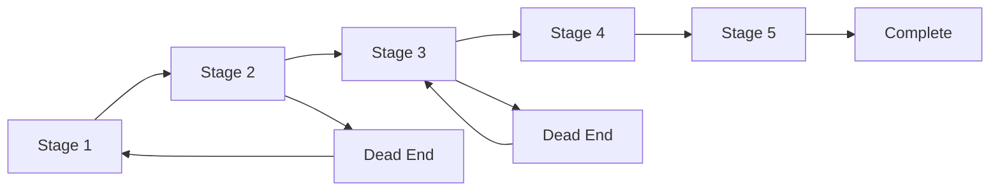

# TVJ - Tom Vs Jerry

    
  
A responsive treasure hunt game mixed with intelligence, surprise and risk around every corner.
based on cartoon Tom and Jerry.   [Live Link](https://harsha2803.github.io/TVJ-Puzzle-Game/)

 

## Table of Contents
<!-- <> -->
* [Features](#features)
* [Flow Chart Markdown](#flow-chart-markdown)
* [Player and Analytics](#player-and-analytics)
* [Login and Registration](#login-and-registration)
* [Authorization and Security](#authorization-and-security)
* [Screen Shots](#screen-shots)
* [Game Structure](#game-structure)
* [General Instructions for the game](#general-instructions-for-the-game-are-as-follows)
* [Stage 1: Find The Cheese](#stage-1-find-the-cheese)
* [Stage 2: What's My Name ?](#stage-2-What's-My-Name-?)
* [Stage 3: Keep In Order!!](#stage-3-Keep-In-Order-!!)
* [Stage 4 : Listen Some Music !](#Stage-4-Listen-Some-Music-!)
* [Stage 5: The Memory Game](#stage-5-the-memory-game)
* [Completion](#completion)
* [Tech stack](#tech-stack)
* [Project Set-up](#project-set-up)
* [Credits](#credits)
<!-- <> -->

## Features

- [x] 5 stages of game
    1. Find The Cheese
    2. What's My Name ?
    3. Keep In Order!!
    4. Listen Some Music !
    5. The Memory Game
- [x] Soft skills assessed
    1. Critical Thinking
    2. Decision Making
    3. Patience
    4. Problem Solving
    5. Eye for Detail
    6. Logical reasoning
    7. Auditory Comprehension
    8. Knowledge
<!--     
 -->
- [x] Dead Ends
    1. First on stage 2:  What's My Name ?
    2. Second on stage 3:  Keep In Order !!
 

## Flow Chart Markdown

### Player and Analytics
- [x] User leader board
- [x] Admin Panel
- [x] Overall and  each Player's analytics in admin panel
- [x] Players can't skip level by changing web adress.
- [x] Saving user state and level after each stage in database.

## Login and Regstration
- [x] Sign in with Google (Oauth) [recommended for better user experience]
- [x] User Sign up
- [x] User Log in
- [x] admin login

## Authorization and Security

Only logged in users can:
- [x] Play game
- [x] Access player analysis
- [x] Only admin can access Admin Panel

# Screen Shots

        Sign Up Page

         
        
          
        Login Page

         
        
          
         Admin Panel and LeaderBoard

        
          
         Player Scorecard View 

        
          
         Deadend 

        
          
         Completion View

        

# Structure of the game

- The game has develoved to asses user's soft skill while providing an immersive experience.  

## General Instructions for the game are as follows:

- Sign In Using Gmail.
- Read Clues carefully and Proceed.
- If you hit deadend, You'll be redirected to subsequent stage.
- You can restart game at any point of time.

# Stage 1: Find The Cheese

        
    

## Soft skills tested: 

- Eye For Detail
- Patience

## Dead end: 0

## Clues: 

    - The image show a living room where Tom has hidden Cheese.

## Puzzle

You have to find where the cheese is, this will assess your patience and eye for detail soft skill.

## Solution

 
  
 Click to view ? 

  Cheese is at left top corner. Exactly Under Stage Name.

## Motive

This stage aims to give players a head start and take them on a thrilling journey of treasure hunting.  

 

# Stage 2: What's My Name ?

        
    

## Soft skills tested: 

- Critical Thinking
- Eye for Detail
- Knowledge
- Memory

## Clues: 

You are given some set of rules. You have to find out Tom's real name that is "THOMAS"(case insensitive). A bulb is kept on screen just as a clue. CLues are given such a way that user's softskills like Memory, Knowledge, Critical Thinking, Eye for detail are assessed.

## Puzzle

Simple Answer, Enter as a  string.

## Dead end: 1

- If the player choose a different answer, the Jerry is caught, Hence Deadend.

## Solution

 
  
 Click to see? 

  Thomas  

## Motive

This stage is design to assess memory and critical thinking.

 

# Stage 3: Keep In Order!!

        
    

## Soft skills tested:

- Logical Reasoning
- Memory
- Audio Comprehension
- Detailing

## Clues: 
- You are given a video and set of 5 events.

## Puzzle

Watch the video and arrange these set of events chronologically, choose one correct option among given options.

## Dead end: 2

Wrong answer leads to a deadend, takes you back to stage 3 itself.

## Solution

 
  
 Click to see? 

            3, 1, 5, 2, 4

## Motive
The stage tests user of their Memory and Comprehensive soft skills. 

# Stage 4: Listen Some Music !

        
    

## Soft skills tested: 
- Comprehension
- Auditory 

## Clues: 
    The audio is your clue.

## Puzzle
    You need to listen to the audio and answer correctly.

## Solution

 
  
 Click to see? 

  2 

## Motive

The stage is to test user compreshension and Auditory Skills.

 

# Stage 5: The Memory Game

        
    

## Soft skills tested: 

- Eye for Detail
- Memory
- Patience
- Logical Reasoning
- Comprehension

## Clues and Puzzle: 

- Basically not a clue game, but U have to remember which one would be in which tile. You should try to open pair consequently in least possible time possible. 

The final showdown, answer the riddle with full answer to get your reward. 

## Solution

 
  
 Click to see? 

  Find All Pairs.

## Motive

The stage test the curiosity of the user and testing player patience to extreme and his Memory and Logical thinking. 

 

# Completion Page

# Tech Stack:

## Frontend

## Backend

## Database and Authentication

## Hosting 

# Project Set-up

# Getting Started with Create React App

This project was bootstrapped with [Create React App](https://github.com/facebook/create-react-app).

## Available Scripts

In the project directory, you can run:

### `npm start`

Runs the app in the development mode.\
Open [http://localhost:3000](http://localhost:3000) to view it in your browser.

The page will reload when you make changes.\
You may also see any lint errors in the console.

### `npm test`

Launches the test runner in the interactive watch mode.\
See the section about [running tests](https://facebook.github.io/create-react-app/docs/running-tests) for more information.

### `npm run build`

Builds the app for production to the `build` folder.\
It correctly bundles React in production mode and optimizes the build for the best performance.

The build is minified and the filenames include the hashes.\
Your app is ready to be deployed!

See the section about [deployment](https://facebook.github.io/create-react-app/docs/deployment) for more information.

### `npm run eject`

**Note: this is a one-way operation. Once you `eject`, you can't go back!**

If you aren't satisfied with the build tool and configuration choices, you can `eject` at any time. This command will remove the single build dependency from your project.

Instead, it will copy all the configuration files and the transitive dependencies (webpack, Babel, ESLint, etc) right into your project so you have full control over them. All of the commands except `eject` will still work, but they will point to the copied scripts so you can tweak them. At this point you're on your own.

You don't have to ever use `eject`. The curated feature set is suitable for small and middle deployments, and you shouldn't feel obligated to use this feature. However we understand that this tool wouldn't be useful if you couldn't customize it when you are ready for it.

## Learn More

You can learn more in the [Create React App documentation](https://facebook.github.io/create-react-app/docs/getting-started).

To learn React, check out the [React documentation](https://reactjs.org/).

### Code Splitting

This section has moved here: [https://facebook.github.io/create-react-app/docs/code-splitting](https://facebook.github.io/create-react-app/docs/code-splitting)

### Analyzing the Bundle Size

This section has moved here: [https://facebook.github.io/create-react-app/docs/analyzing-the-bundle-size](https://facebook.github.io/create-react-app/docs/analyzing-the-bundle-size)

### Making a Progressive Web App

This section has moved here: [https://facebook.github.io/create-react-app/docs/making-a-progressive-web-app](https://facebook.github.io/create-react-app/docs/making-a-progressive-web-app)

### Advanced Configuration

This section has moved here: [https://facebook.github.io/create-react-app/docs/advanced-configuration](https://facebook.github.io/create-react-app/docs/advanced-configuration)

### Deployment

This section has moved here: [https://facebook.github.io/create-react-app/docs/deployment](https://facebook.github.io/create-react-app/docs/deployment)

### `npm run build` fails to minify

This section has moved here: [https://facebook.github.io/create-react-app/docs/troubleshooting#npm-run-build-fails-to-minify](https://facebook.github.io/create-react-app/docs/troubleshooting#npm-run-build-fails-to-minify)

## credits 

- Tom and Jerry
 
